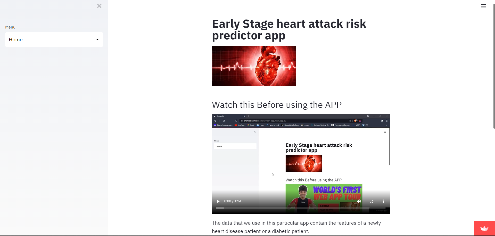
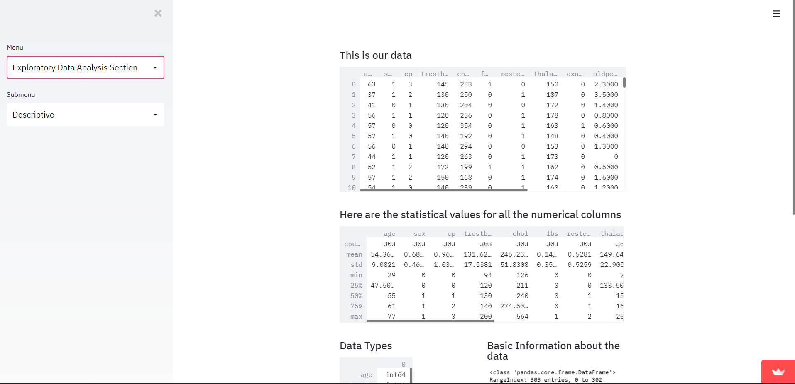
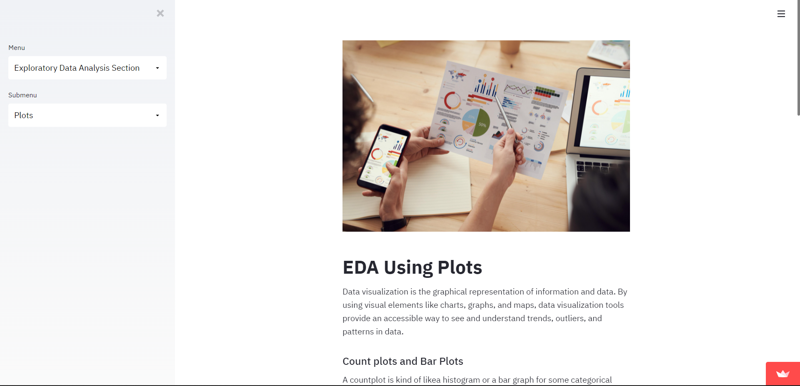
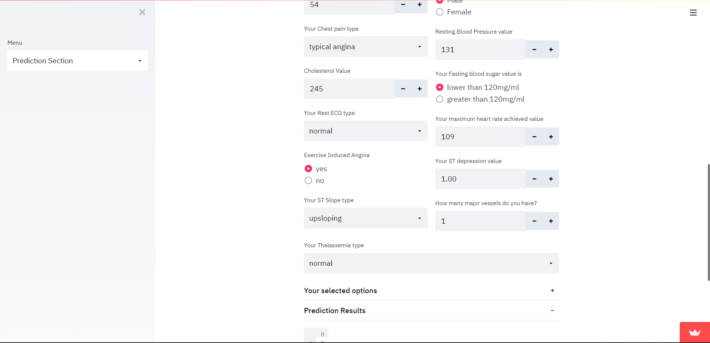

# Machine-Learning-Web-Apps
Building and Embedding Machine Learning Model into a Web App(With Flask,Streamlit,Express,etc)

### Heart Disease Prediction App

#### Description
+ This is a app which help collects the basic information from the user and predicts the outcome whether you have a heart disease or not. This app also contains many visualization charts which was visuzlized with the past data of other patients.

#### Purpose
+ Show a simple EDA of the data
+ Show the Prediction

##### To Install Streamlit
```bash
pip install streamlit
```


#### Running the App
+ cd into app
+ run the following

```bash
streamlit run app.py
```


### Basic Requirements
#### For Python ML Web Apps
+ Streamlit
+ Scikit-learn
+ Pandas
+ Numpy
+ Seaborn
+ Matplotlib
+ Plotly
+ Joblib/Pickle
+ Matplotlib
+ Requests

## Data Source
- https://archive.ics.uci.edu/ml/datasets/heart+disease


## Screenshots

#### Home Page



### EDA - Descriptive Section



### EDA - Plots Page



### Machine Learning - Prediction Section



# Heart App

[You can access my web app over here.](https://share.streamlit.io/asr373/heart-app/main/app.py)

#### By
+ Adith Sreeram A S
